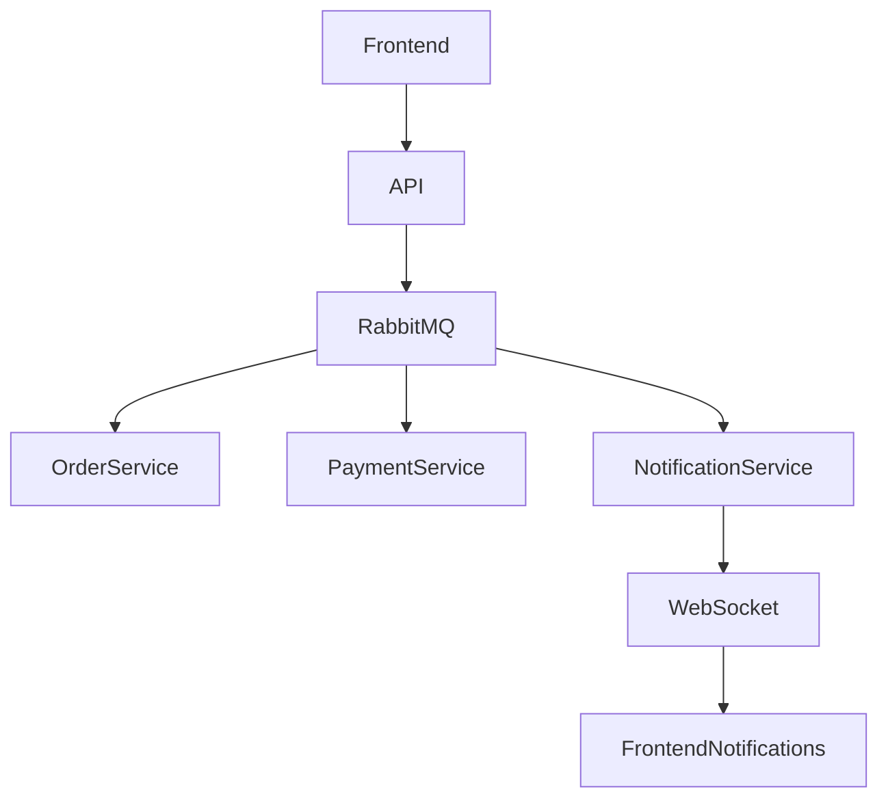

# Event-Driven Microservices Demo

This project is a **simple event-driven microservices architecture** built to demonstrate how independent services communicate using **message queues, workers, and real-time notifications**.

The system simulates a basic **order and payment workflow**, where events are published and consumed asynchronously using a message broker.

---

# Architecture Overview

The application is composed of multiple independent services running in containers and communicating through **asynchronous messaging**.

Main technologies used:

- Node.js
- RabbitMQ
- Docker
- Vue.js
- Quasar Framework
- WebSocket

All services run inside Docker containers and are orchestrated with Docker Compose.

---

# System Flow

The system demonstrates a simple workflow:

1. The frontend sends a **POST request** to create an order.
2. The API publishes an event to the message queue.
3. The **Order Service** processes the order and publishes a new event.
4. The **Payment Service** consumes the event and simulates a payment confirmation.
5. The **Notification Service** listens to events and pushes updates to the frontend using WebSockets.
6. The frontend updates a notification badge in real time.

High level flow:

Frontend
↓
API Service
↓
RabbitMQ (Event Queue)
├── Order Service (Worker)
├── Payment Service (Worker)
└── Notification Service
↓
WebSocket
↓
Frontend Notification

---

# Architecture Diagram



---

# Services

## API Service

Receives HTTP requests from the frontend and publishes events to RabbitMQ.

**Responsibilities:**

- Receive POST requests
- Publish events to the message broker

---

## Order Service

A background worker that consumes order events.

**Responsibilities:**

- Process new orders
- Update order status
- Publish the next event in the workflow

---

## Payment Service

Simulates payment processing.

**Responsibilities:**

- Consume order events
- Simulate payment confirmation
- Publish payment events

---

## Notification Service

Handles real-time notifications.

**Responsibilities:**

- Consume events from RabbitMQ
- Send notifications to connected clients via WebSocket

---

## Frontend

Built with Vue.js and Quasar.

**Responsibilities:**

- Send requests to the API
- Maintain a WebSocket connection
- Update notification badges in real time

---

# Running the Project

Make sure you have installed **Docker**

Then run:

```bash
docker compose up --build
```

After the containers start, the services will be available.

Frontend

```bash
http://localhost:9000
```

RabbitMQ Management UI

```bash
http://localhost:15672
```

Default credentials:

```bash
user: guest
password: guest
```
