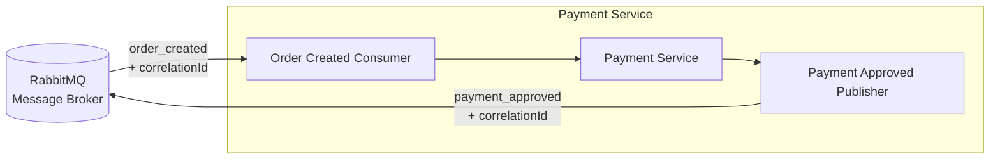

# C4 - Component Diagram - Notification Service

Este diagrama mostra os componentes internos do microsserviço
Payment Service e como eles se relacionam.

O objetivo é explicar a organização interna do serviço.

