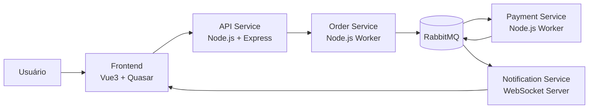

# C4 - Container Diagram

Este diagrama mostra os principais containers do sistema e como eles se comunicam.

```mermaid
flowchart LR

User[Usuário]

Frontend[Frontend<br>Vue3 + Quasar]

APISvc[API Service<br>Node.js + Express]

OrderSvc[Order Service<br>Node.js Worker]

PaymentSvc[Payment Service<br>Node.js Worker]

NotificationSvc[Notification Service<br>WebSocket Server]

Rabbit[(RabbitMQ)]

User --> Frontend

Frontend --> APISvc

APISvc --> OrderSvc

OrderSvc --> Rabbit
PaymentSvc --> Rabbit

Rabbit --> PaymentSvc
Rabbit --> NotificationSvc

NotificationSvc --> Frontend
```
