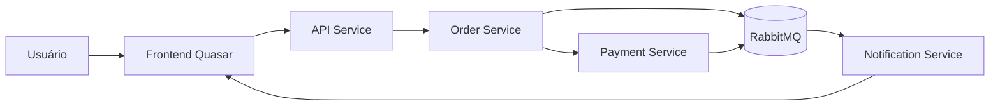

# C4 - Context Diagram

Este diagrama mostra como os usuários interagem com o sistema e
quais sistemas externos estão envolvidos.

```mermaid
flowchart LR

User[Usuário] --> Frontend[Frontend Quasar]

Frontend --> API[API Service]

API --> Order[Order Service]
Order --> Payment[Payment Service]

Order --> Rabbit[(RabbitMQ)]
Payment --> Rabbit

Rabbit --> Notification[Notification Service]

Notification --> Frontend
```
