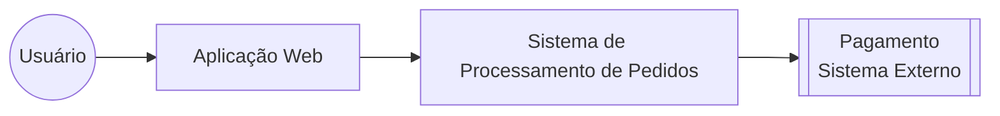

# C4 - Context Diagram

Este diagrama mostra como os usuários interagem com o sistema e quais
sistemas externos estão envolvidos.

O objetivo deste diagrama é apresentar a visão de mais alto nível da
arquitetura, sem detalhar os microsserviços internos.

